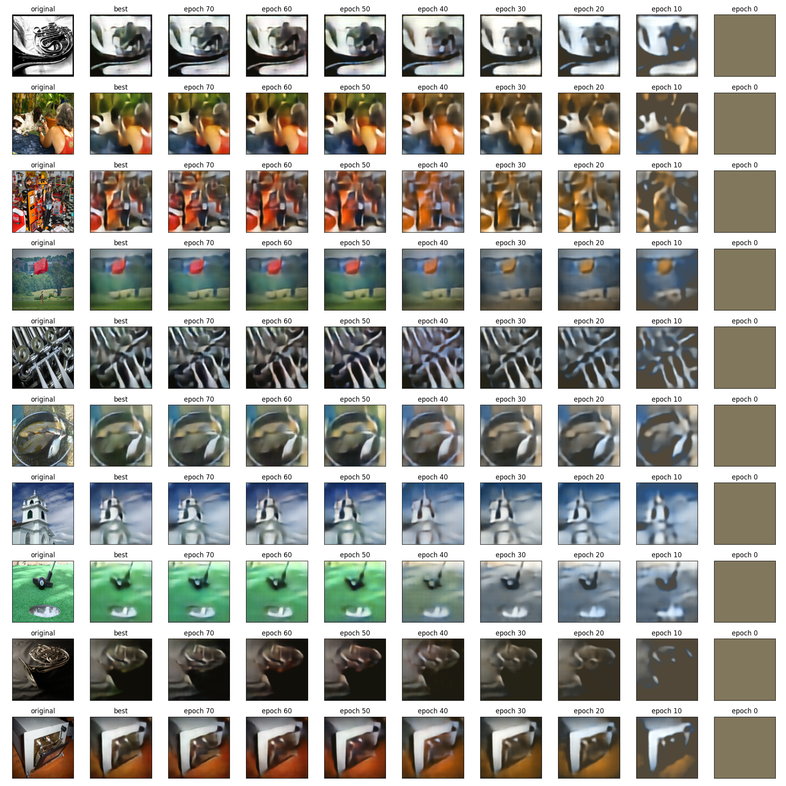
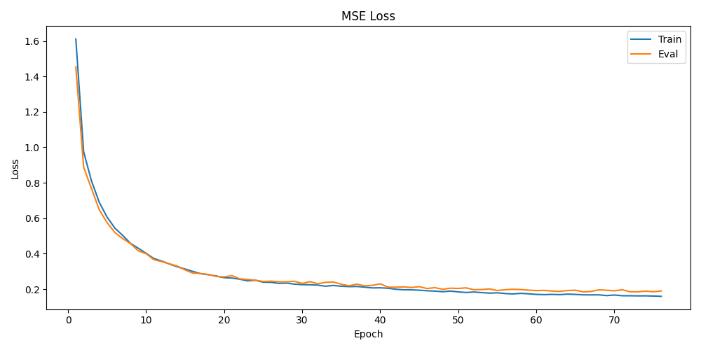

# Convolutional Autoencoder with AlexNet Encoder on Imagenette Dataset

This repository contains an implementation of a Convolutional Autoencoder using the [AlexNet](https://en.wikipedia.org/wiki/AlexNet) architecture as the encoder.  The autoencoder is a type of neural network used for unsupervised learning, particularly in the field of dimensionality reduction and image reconstruction.

The autoencoder is trained on the [Imagenette](https://github.com/fastai/imagenette) dataset, which is a subset of 10 easily classified classes from the [Imagenet](http://www.image-net.org/) dataset.

## Results




## Table of Contents
- [Installation](#installation)
- [Dataset](#dataset)
- [Usage](#usage)
- [Files](#files)
- [License](#license)

## Installation
1. Clone the repository
    ```commandline
    git clone https://github.com/abinthomasonline/alexnet-autoencoder.git
    ```
2. Install the required packages
    ```commandline
    cd alexnet-autoencoder
    pip install -r requirements.txt
    ```

## Dataset
The demo uses the [Imagenette](https://github.com/fastai/imagenette) dataset. The dataset can be downloaded from [here](https://s3.amazonaws.com/fast-ai-imageclas/imagenette2.tgz).
Download the dataset and extract it to the `data` directory.
```commandline
wget https://s3.amazonaws.com/fast-ai-imageclas/imagenette2.tgz -P data/
tar -xzf data/imagenette2.tgz -C data/
```

## Usage
### Train
```commandline
python train.py
```
The checkpoints and metrics will be saved in the `checkpoints` directory. 

### Plot
```commandline
python plot.py
```
Plots of loss curve and reconstructed images will be saved in the `plots` directory.

## Files
```
alexnet-autoencoder/
├── checkpoints/                
│   ├── best.pt                 # Best checkpoint
│   ├── epoch_{i}.pt            # Checkpoint at epoch i
│   ├── latest.pt               # Checkpoint at latest epoch
│   └── metrics.json            # Metrics
├── data/                       
│   └── imagenette2/            # Imagenette dataset
├── plots/                      
│   ├── loss.png                # Loss curve
│   └── reconstructions.png     # Reconstructed images
├── model.py                    # Model definition
├── plot.py                     # Plotting
├── README.md                   # This file
├── requirements.txt            # Requirements file
└── train.py                    # Training
```

## License
This project is licensed under the MIT License. Feel free to use, modify, and distribute the code as per the terms of the license.
